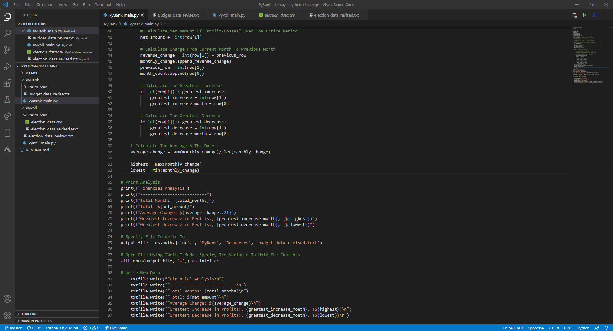
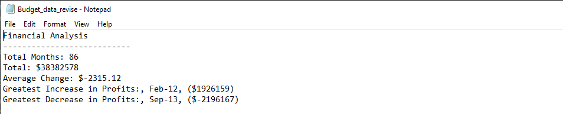
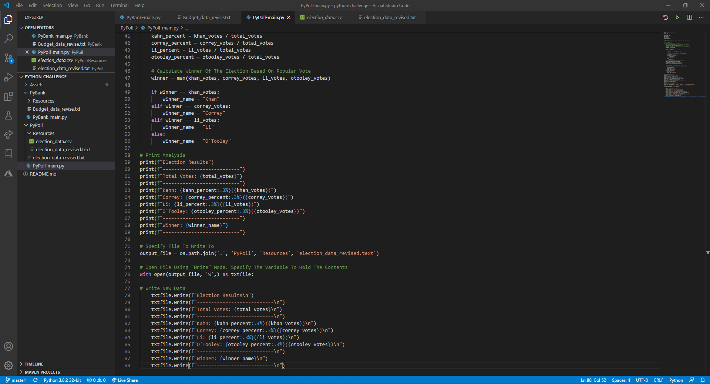
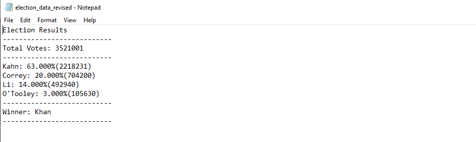

# python-challenge

## Table of Content ##
*Overview,*
*PyBank,*
*PyPoll*
*Techonlogies used*

## Overview ##
*PyBank*
Create a Python script for analyzing the financial records of a company.
Analyze the following:
* The total number of months included in the dataset
* The net total amount of "Profit/Losses" over the entire period
* The average of the changes in "Profit/Losses" over the entire period
* The greatest increase in profits (date and amount) over the period
* The greatest decrease in losses (date and amount) over the period
See result below:
### PyBank: Running Code###

### PyBank: Result of Analysis###

*PyPoll*
Help a small rural town modernize its vote counting process. A set of poll data is given and create a Python script that analyze the votes and calculates the following:
* The total number of votes cast
* A complete list of candidates who received votes
* The percentage of votes each candidates won
* The total number of votes each candidates won
* The winner of the election based on popular votes
See result below:
### PyPoll: Running Code###

### PyPoll: Result of Analysis###

## Technologies used ##
* Python (import, read, write, print, output functions)
* .cvs files
  
## Authors ##
Sylvain David - Data Analytics Bootcamp - Vanderbilt University - 2020